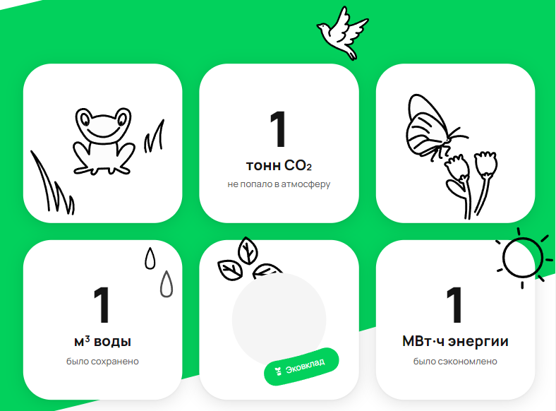
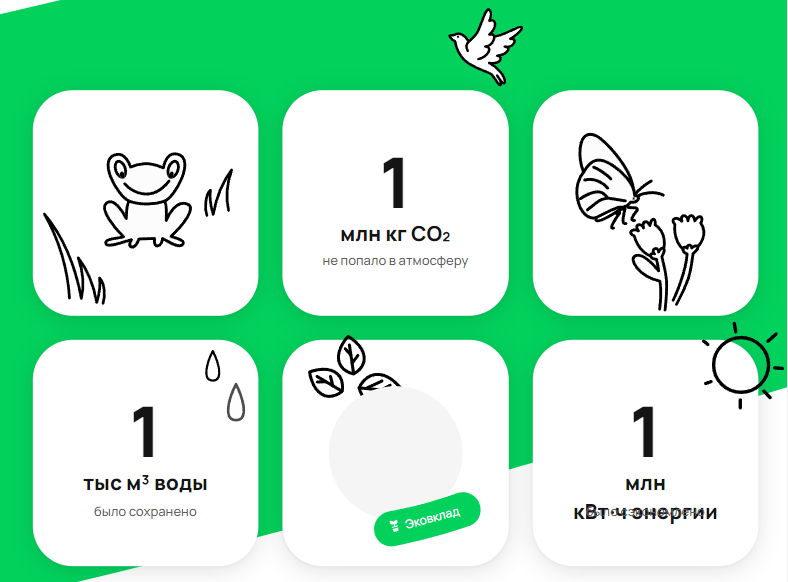
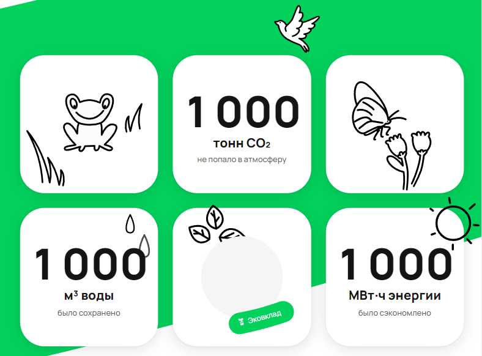

## Баги

## Тестовая среда:
## ОС: Windows 11
## Устройство: Honor MagicBook 16 Pro
## Браузер: Google Chrome (версия 124.0.6367.29 ( от 3 апреля 2024))

Дата проведения тестирования: 14.04.2024

## Баг #1: Некорректное склонение при подставлении значения
- **ID Теста:** 3, 4
- **Название теста:** group_one_thousand, group_one_thousand_one
- **Описание:** При тестировании обнаружено, что на при подставлении тестового значения в 1000, на счётчике воды неккоректно склоняется слово "тонна" (тонн)
- **Шаги для воспроизведения:**
  1. Загрузить тестовые данные.
  2. Выполнить тесты и просмотреть результаты на экране экосчётчиков.
- **Ожидаемый результат:** Экосчётчики отображают "1 тонна CO2", "1 МВт энергии", "1 м³ воды".
- **Фактический результат:** Экосчётчики отображают "1 тонн CO2", "1 МВт энергии", "1 м³ воды".
- **Скриншот**

## Баг #2: Перекрытие элементов UI на экосчётчиках

- **ID Тестов:** 9, 10
- **Название тестов:** group_three_million, group_three_million_one
- **Описание:** Элементы интерфейса перекрывают данные на экосчётчиках при подставке значений в миллионах.
- **Шаги для воспроизведения:**
  1. Загрузить тестовые данные.
  2. Выполнить тесты и просмотреть результаты на экране экосчётчиков.
- **Ожидаемый результат:** Данные на экосчётчиках четко видны и не перекрыты другими элементами интерфейса.
- **Фактический результат:** Элементы интерфейса перекрывают часть данных на экосчётчиках (конкретно на счётчике кВт энергии).
- **Важность:** Низкая 
- **Скриншот:**

## Баг #3: Ошибки при переводе в систему СИ на экосчётчиках

- **ID Тестов:** 9,10 
- **Название тестов:** group_three_million, group_three_million_one
- **Описание:** При подставлении миллионных значений, конвертация происходит неверно, и вместо "1 тыс. тонн воды" и "1 тыс. МВт энергии" отображаются "1 млн кг" и "1 млн кВт"
- **Шаги для воспроизведения:**
  1. Загрузить тестовые данные.
  2. Выполнить тесты и просмотреть результаты на экране экосчётчиков.
- **Ожидаемый результат:** Верная конвертация значений "1 тыс. тонн воды" и "1 тыс. МВт энергии" .
- **Фактический результат:** Милионные значения "1 млн кг" и "1 млн кВт".
- **Важность:** Средняя 
- **Скриншот:**

## Баг #3: Неправильное отображение значений на экосчётчиках

- **ID Теста:** 11
- **Название теста:** group_three_below_million
- **Описание:** При подстановке значения 999999 в счётчиках возникают проблемы с отображением данных на экосчётчиках.
- **Шаги для воспроизведения:**
    1. Загрузить тестовые данные.
    2. Выполнить тесты и просмотреть результаты на экране экосчётчиков.
- **Ожидаемый результат:** Экосчётчики отображают "999 т CO2", "999 МВт энергии", "990 м³ воды".
- **Фактический результат:** Данные на экосчётчиках отображаются некорректно: 1000 т СО2, 1000 МВТ энергии, 1000 м³ воды 
- **Важность:** Средняя
- **Скриншот:**

